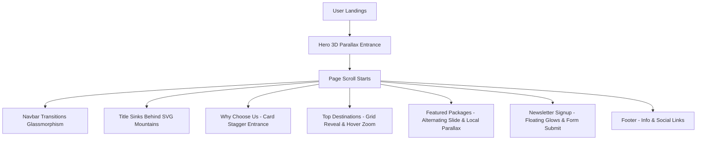

# Voyage Luxe - Luxury Trip Landing Page

Voyage Luxe is a luxury travel single-page landing page built with **React**, **Vite**, **Tailwind CSS**, and **GSAP (GreenSock Animation Platform)**. The project features high-performance 3D vector-parallax layers, dynamic scroll-revealed elements, and a completely modular architecture where all content can be easily updated via a single configuration file.

---

## 🛠️ Bagaimana Web Ini Dibuat (Vibecode Agentic Workflow)

Proyek ini dibangun menggunakan **Vibecode**, sebuah metodologi *agentic pairing* yang memadukan rekayasa perangkat lunak modern dengan instruksi AI yang terperinci. Alur pembuatannya meliputi langkah-langkah berikut:

1. **Analisis Struktur Awal**:
   Menganalisis kode HTML awal yang memiliki skema warna khusus (Palette HSL/Hex bernuansa mewah) serta gaya tipografi (Playfair Display & Hanken Grotesk).

2. **Inisialisasi Project**:
   Membuat project React berbasis Vite menggunakan `create-vite` secara otomatis untuk performa *bundling* cepat dan *Hot Module Replacement (HMR)* yang instan.

3. **Instalasi & Konfigurasi Lingkungan**:
   - Memasang **Tailwind CSS (v3)** dan **PostCSS** untuk integrasi utility styling yang responsif.
   - Memasang **GSAP** & `@gsap/react` untuk menggerakkan elemen web dengan halus tanpa menurunkan performa (60+ FPS).

4. **Pemisahan Lapisan Data (Data Separation)**:
   Memindahkan seluruh salinan teks (*copywriting*), tautan gambar, peringkat, harga, ikon, dan tautan navigasi ke satu file data sentral di `src/data/tripData.js`. Hal ini memisahkan isi konten dengan struktur kode tampilan.

5. **Pembuatan Komponen & Integrasi GSAP**:
   - Membagi halaman menjadi komponen React modular (`Navbar`, `HeroParallax`, `WhyChooseUs`, `TopDestinations`, `FeaturedPackages`, `Newsletter`, `Footer`).
   - Menerapkan efek **3D Parallax** interaktif pada bagian Hero menggunakan beberapa layer grafis SVG berbentuk pegunungan dan danau yang bergerak dengan kecepatan berbeda menggunakan GSAP `ScrollTrigger`.
   - Menambahkan animasi transisi masuk staggered (*scroll reveal*) pada bagian-bagian konten.

6. **Pengujian & Validasi Build**:
   Melakukan proses kompilasi bundel (*production build*) untuk memastikan bahwa file CSS dan JS ter-minify dengan sempurna dan tidak ada error sintaksis.

---

## 🧭 Alur Website (User Flow & Architecture)

Website ini dirancang sebagai halaman tunggal (*One-Page Application*) yang dinamis dan mengalir mulus saat digulir. Berikut adalah alur navigasi dan interaksi pengguna:



### Penjelasan Detil Alur Web:
1. **Pemuatan Awal (Initial Page Load)**:
   - Pengguna masuk ke situs. Animasi awal memicu latar langit membayang masuk (*fade-in*), matahari terbit bersinar membesar (*scale-up*), pegunungan naik ke posisi awal, dan judul utama meluncur lembut ke atas.
   - Widget Pencarian (*Search Widget*) mengembang masuk dari bawah, siap digunakan.

2. **Pengguliran (Scrolling Experience)**:
   - **Navbar Transisi**: Saat pengguna menggulir ke bawah melewati 50px, Navbar berubah warna dari transparan menjadi putih buram (*glassmorphic blur*) agar tetap terbaca dengan baik di atas konten yang bergulir.
   - **Efek Paralaks 3D**: Judul utama turun lebih lambat dibanding pengguliran layar sehingga secara visual tampak tenggelam di balik pegunungan depan (foreground) dan danau.
   - **Stagger Reveal**: Kartu-kartu di bagian *Why Choose Us* dan *Top Destinations* muncul dengan transisi staggered (bergantian cepat) dari arah bawah saat menyentuh batas viewport layar.
   - **Image Parallax**: Di bagian *Featured Tour Packages*, gambar bergerak secara vertikal di dalam bingkainya sendiri dengan efek paralaks lokal untuk memberikan kedalaman visual yang tinggi.

3. **Interaksi Pengguna (Interactions)**:
   - **Card Hover**: Mengarahkan kursor pada kartu destinasi akan memperbesar gambar secara halus (*zoom-in*) dan memunculkan bayangan dinamis (*hover-card-shadow*).
   - **Formulir Newsletter**: Pengguna dapat memasukkan email untuk berlangganan. Submit tombol memicu pesan sukses visual.
   - **Navigasi Responsif**: Pada perangkat seluler, tombol menu hamburger memicu laci navigasi atas yang meluncur dari atas dengan transisi elastis.

---

## 📂 Cara Mengubah Isi Konten (Data Modification)

Untuk mengubah seluruh teks, harga, gambar, atau link di halaman web ini, Anda tidak perlu menyentuh file komponen di folder `src/components`. Cukup edit file:

👉 **[`src/data/tripData.js`](file:///c:/Users/Nobe/OneDrive/Pictures/Desktop/Nobe%20camera/Nobedes/TripLandingPage/src/data/tripData.js)**

### Struktur Data Utama yang Dapat Diubah:
- **`navbar`**: Mengatur teks logo, daftar menu navigasi, dan tombol panggilan aksi (*CTA*).
- **`hero`**: Mengatur teks judul utama bagian atas serta input pencarian (nama destinasi, kalender, opsi traveler).
- **`features`**: Mengatur 3 kartu keunggulan utama beserta ikon material design-nya.
- **`destinations`**: Mengatur galeri destinasi (Bali, Swiss Alps, dll), peringkat bintang, harga dasar, dan tautan gambar.
- **`tours`**: Mengatur paket wisata unggulan, durasi hari, label penanda (*Most Popular* / *Limited Edition*), deskripsi detil, dan foto sampul.
- **`newsletter`**: Mengatur kata-kata ajakan berlangganan dan formulir email.
- **`footer`**: Mengatur rincian alamat kantor, nomor telepon, email resmi, tautan kolom menu bawah, dan hak cipta.

---

## 🚀 Cara Menjalankan Project

Ikuti langkah-langkah di bawah ini untuk memulai server pengembangan lokal Anda:

### 1. Masuk ke Direktori Project
```bash
cd "c:\Users\Nobe\OneDrive\Pictures\Desktop\Nobe camera\Nobedes\TripLandingPage"
```

### 2. Jalankan Mode Development
```bash
npm run dev
```
Setelah server berjalan, buka peramban (*browser*) Anda ke alamat lokal yang tertera pada konsol terminal (misalnya `http://localhost:5173`).

### 3. Buat Bundel Produksi (Build)
```bash
npm run build
```
Proses kompilasi akan menghasilkan folder `/dist` yang siap untuk diunggah langsung ke server hosting (Netlify, Vercel, Firebase Hosting, dll).
